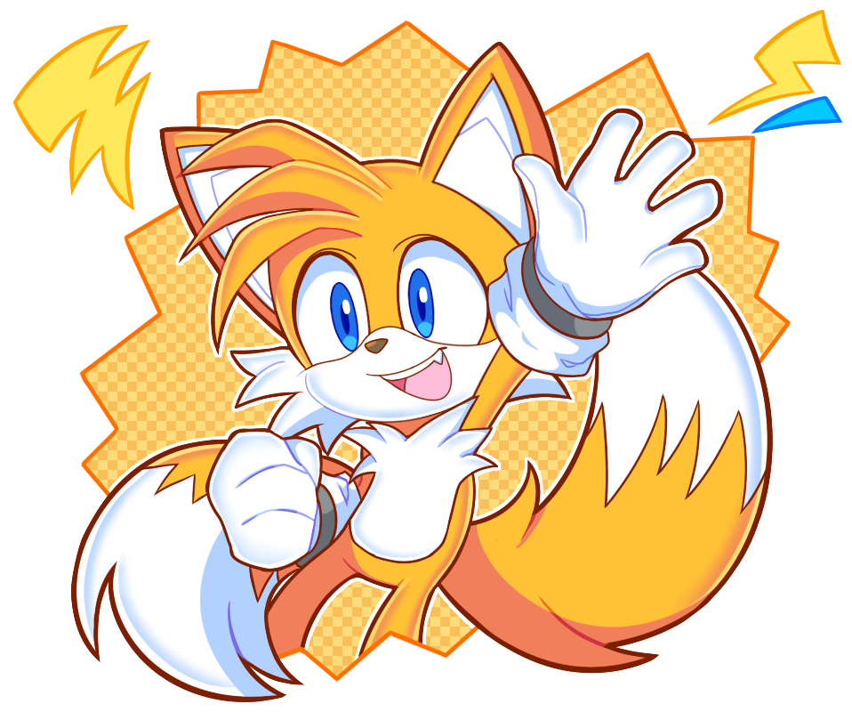

<!-- ═══════════════ HEADER ANIMADO ═══════════════ -->
<div align="center">


<a href="https://github.com/VitorMelo19">
  
</a>

<br/>

<a href="https://www.linkedin.com/in/oficialvitormelo"></a>
<a href="mailto:vitormeloemprego@gmail.com"></a>
<a href="https://instagram.com/eae_vitormelo"></a>

<br/>


</div>

---

<!-- ═══════════════ SOBRE MIM + TAILS ═══════════════ -->
## 🧠 `Sobre Mim`

<table>
<tr>
<td width="62%" valign="top">

```python
class VitorMelo:
    def __init__(self):
        self.nome = "Vitor Melo"
        self.local = "São Paulo, Brasil 🇧🇷"
        self.cursando = "Análise e Desenvolvimento de Sistemas"
        self.foco = ["Dados", "Machine Learning", "Cloud"]
        self.estudando = ["Python", "Power BI", "SQL", "AWS", "Azure", "C#"]
        self.mascote = "Tails 🦊 — o gênio da tecnologia"

    def objetivo(self):
        return "Criar projetos práticos que ensinam e entregam valor"
```

</td>
<td width="38%" align="center" valign="middle">

<!-- Coloque sua imagem do Tails em assets/tails.png -->


<sub><i>"Todo bom dev precisa de um bom parceiro de voo."</i></sub>

</td>
</tr>
</table>

> 🦊 **Por que o Tails?** Ele é o gênio da tecnologia do Sonic: constrói, inventa e resolve problemas com engenhosidade. É assim que eu quero trabalhar.

---

<!-- ═══════════════ STACK ═══════════════ -->
## ⚙️ Stack & Ferramentas

<div align="center">


<br/>


<br/><br/>


</div>

---

<!-- ═══════════════ TRILHA DE APRENDIZADO ═══════════════ -->
## 🚀 Trilha de Evolução

| Área | Status | Progresso |
|------|--------|-----------|
| 🐍 Python & Dados | Em prática |  |
| 🗄️ SQL | Em prática |  |
| 📊 Power BI | Em prática |  |
| 🤖 Machine Learning | Estudando |  |
| ☁️ Cloud (AWS / Azure) | Estudando |  |
| 🔷 C# | Estudando |  |

---

<!-- ═══════════════ ESTATÍSTICAS ═══════════════ -->
## 📈 Estatísticas

<div align="center">


</div>

---

<!-- ═══════════════ PROJETOS ═══════════════ -->
## 🛠️ Projetos em Destaque

<div align="center">

<a href="https://github.com/VitorMelo19/Ficcao-Criminal"></a>
<a href="https://github.com/VitorMelo19/ClickPet"></a>
<a href="https://github.com/2024-2-NADS1/Projeto7"></a>
<a href="https://github.com/2025-1-NADS2/Projeto6"></a>

</div>

---

<!-- ═══════════════ COBRINHA ANIMADA ═══════════════ -->
## 🐍 Minhas Contribuições

<div align="center">


</div>

---

<!-- ═══════════════ CITAÇÃO + FOOTER ═══════════════ -->
<div align="center">


<br/>

### 🤝 Vamos conversar? Estou aberto a parcerias, estágios e projetos!


</div>
